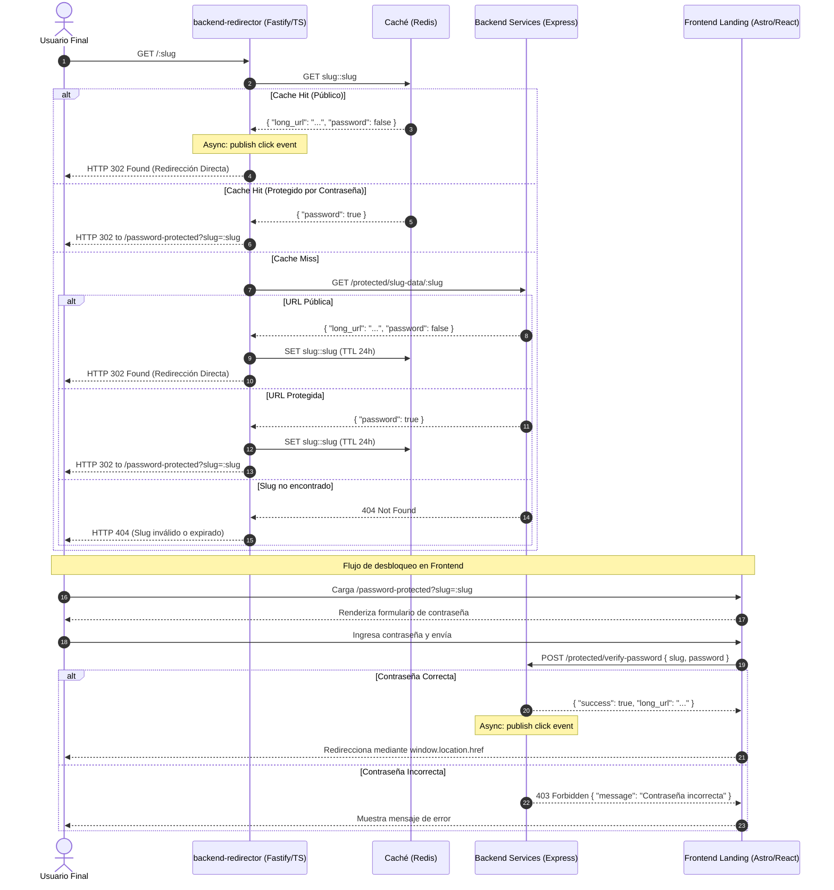

# ADR-003: Migración del Redireccionador a Fastify y Delegación de Contraseñas al Frontend

- **Estado**: Aceptado
- **Fecha**: 2026-07-10
- **Autor**: Paolo Herrera
- **Version**: 1.2.0
- **Última modificación**: 2026-07-18

---

## Contexto y Problemática

En la fase inicial del proyecto, se tenía el sistema de redirector en `backend-services`. Esto se volvió un problema si se quería escalar. Concentrar la lógica de redirección junto al core del sistema podría traer problemas de rendimiento si, por ejemplo, una shor URL se hacía viral y/o múltiples usuarios intentaban acortar un link al mismo tiempo, además, si `backend-services` fallaba, no solamente denegaba la creación de short URLs, también denegaba la redirección de links ya creados, lo cual evidentemente es un problema. Esto se conoce como "Single Point of Failure" (SPOF).

Para solucionarlo parcialmente, se optó por extraer el redirector en un microservicio dedicado (`backend-redirector`). En un principio se optó por Remix SSR con el propósito de generar una interfaz en el servidor para los link cortos que tenían contraseña y así no redireccionar a los usuarios a un entorno diferente. Sin embargo, esto trajo varios problemas:

1. **Redundancia de SSR**: Usar un framework completo de React (Remix) para servir redirecciones HTTP `302` y una única pantalla estática consume recursos y memoria excesivos en producción.
2. **Over Engineering**: Remix es un framework fullstack, abarcar el problema de redirección con un framework así de grande es considerado sobreingeniería cuando, por ejemplo, Express puede hacer lo mismo sin que sea tan pesado.

---

## Alternativas Evaluadas

Para tomar una decisión, se tuvo que evaluar diversas alternativas (tres en total) las cuales fueron:

### Opción A: Mantener Remix SSR:

Mantener el framework de backend ya estructurado junto al SSR para las vistas de las ShortUrl que están protegidas por contraseña.

- **Ventajas (Pros):**
  - **Ahorro de tiempo:** Evita tener que reestructurar el backend. Como dice el dicho "si no está roto, no lo arregles."
- **Desventajas (Cons):**
  - **Centralización de vistas:** Si el servicio de redirección no estaba disponible, las vistas de contraseña también se verían afectadas, lo cual genera una experiencia de usuario pobre.
  - **Demasiado para un simple redirector:** Usar un framework con SSR incluido que está orientado para ser fullstack solamente por una vista es **Sobreingeniería**. No se aprovecha todo lo que el framework ofrece y puede generar bajo rendimiento en las pruebas de carga en comparación con algo más _liviano_

### Opción B: Node.js con Express:

Una alternativa que se evaluó fue usar el mismo entorno que `backend-services`, es decir, **Node.js** junto con **Express**.

- **Ventajas (Pros):**
  - **Velocidad de desarrollo:** Como es un entorno de desarrollo conocido, entonces la velocidad de reimplementar el `backend-redirector` sería en un menor tiempo que en otras alternativas."
  - **Simplicidad y Flexibilidad:** Este entorno de desarrollo es simple y sumamente flexible para implementar la arquitectura y estructura que uno decida.
  - **Velocidad aceptable:** Según benchmarks, la velocidad este entorno ronda los 36230 req/seg en un entorno linux x64 | 4 vCPUs | 15.6GB Mem ([Ver referencia](https://github.com/fastify/benchmarks/))
- **Desventajas (Cons):**
  - **Bajo aprendizaje y poca motivación:** Como el objetivo principal de este proyecto es aprender, Express al ser un framework ya conocido no genera nuevo conocimiento en el uso de herramientas, además, siendo sincero, se siente _aburrido_ usar el mismo framework.

### Opción C: Fastify (TypeScript) ✅ **Elegida**

Fastify es un framework web para Node.js diseñado con foco en rendimiento y bajo consumo de recursos. Su modelo de plugins, serialización JSON nativa (con `fast-json-stringify`) y arquitectura modular lo convierten en una alternativa ideal para servicios que deben procesar gran volumen de tráfico con latencia mínima.

- **Ventajas (Pros):**
  - **Alto rendimiento:** Según benchmarks oficiales, Fastify es capaz de procesar aproximadamente un 50% más de peticiones por segundo que Express en condiciones equivalentes ([Ver referencia](https://fastify.dev/benchmarks/)), algo perfecto para un redirector.
  - **Modelo de plugins:** Permite encapsular funcionalidad de forma modular sin acoplar el código, facilitando el testing y la mantenibilidad.
  - **Serialización JSON nativa:** `fast-json-stringify` acelera la serialización de respuestas JSON sin configuración adicional.
  - **TypeScript nativo:** A diferencia de Express (que requiere `@types/express`), Fastify está diseñado para TypeScript desde su origen, lo que mejora la experiencia de desarrollo y la seguridad de tipos.
- **Desventajas (Cons):**
  - **Curva de aprendizaje:** Al ser un framework desconocido, requiere tiempo de adaptación en comparación con Express.
  - **Ecosistema de plugins más reducido:** Aunque crece rápidamente, el ecosistema de plugins de Fastify es menor que el de Express.

## Decisión de Arquitectura

Para simplificar el sistema, maximizar el rendimiento y optimizar el consumo de infraestructura, se toman las siguientes decisiones:

1. **Reescribir `backend-redirector` en Fastify (Typescript)**:

   - Migrar el microservicio a Fastify es una decisión fundamentada en su velocidad y arquitectura. Fastify tiene ventajas sobre varios frameworks debido a su velocidad: de acuerdo a benchmarks, es capaz de procesar aproximadamente el 50% más de peticiones por segundo que Express (https://fastify.dev/benchmarks/), algo perfecto para un redirector; su modelo de plugins y serialización en JSON nativa permiten, además, procesar las mismas tareas que Express con menos recursos.

2. **Delegar la Interfaz de Contraseña al Frontend (Landing Page)**:
   - El redireccionador en Fastify ya no renderizará vistas HTML.
   - Si el redireccionador detecta que el slug está protegido (`password: true`), responderá con una redirección HTTP `302` hacia el `frontend-landing` (alojado en un CDN de Cloudflare).
   - El `frontend-landing` (Astro) mostrará una interfaz premium para solicitar la contraseña y llamará a la API segura del backend para validarla.

---

## Flujo de Control Rediseñado

---

## Consecuencias y Beneficios

### Beneficios

- **Rendimiento Máximo**: El redireccionador se enfoca en una sola tarea (redirecciones rápidas y caché en memoria), reduciendo al mínimo la latencia en la ruta crítica del tráfico.
- **Separación de Responsabilidades**: El frontend estático (CDN) maneja toda la UI interactiva, mientras que el redirector se mantiene stateless y optimizado para APIs.
- **Fácil Escalamiento**: El contenedor de Fastify puede escalarse horizontalmente en Kubernetes o Cloud Run con un consumo de recursos menor al de Remix o Express.

### Trade-offs y Costos

- **Mayor complejidad operacional**: Se suma un servicio adicional al sistema que debe ser desplegado, monitoreado y mantenido de forma independiente.
- **Dependencia indirecta del frontend**: El flujo de desbloqueo por contraseña depende de que `frontend-landing` esté disponible. Si el CDN o el frontend presenta una interrupción, los usuarios no podrán acceder a las shorturls protegidas, incluso si el redirector y el backend están operativos.
- **Superficie de ataque en `verify-password`**: Al delegar la validación de contraseñas al frontend, el endpoint `POST /protected/verify-password` queda expuesto a ataques de fuerza bruta. Esto hace que la implementación de **rate limiting** en dicho endpoint sea un requisito de seguridad no negociable.
- **Riesgo de exposición de Endpoint**: Existe un riesgo de ataque en `backend-services`. Al haber un endpoint en el cual `backend-redirector` consulte para saber si existe la URL, dicho endpoint podrá quedar expuesto a ataques. Para mitigar el riesgo, se ha decidido usar un middleware de verificación y un token de autorización compartido en las variables de entorno, tanto en `backend-redirector` como en `backend-services`. Como eventualmente el endpoint de `backend-services` para consultar slugs no estará en internet, la implementación del token de autorización es solamente una capa más y funciona para un entorno de desarrollo.
- **Coexistencia de frameworks**: Mantener Fastify en el redirector y Express en `backend-services` implica mantener dos ecosistemas de plugins, dos configuraciones de TypeScript y dos curvas de aprendizaje en paralelo. Esto aumenta la complejidad de debugging y mantenimiento a largo plazo.

---

## Relación con otros ADRs

- **ADR-002**: Establece la arquitectura hexagonal para `backend-services`. El redirector, ya había sido extraido desde hace un tiempo como un microservicio separado para resolver el SPOF identificado en ese contexto.
- **ADR-004**: Define el dominio rico (DDD) en `backend-services`, que incluye la validación de slugs y URLs que el redirector consume a través del endpoint interno.

---

## Resultado y Lecciones Aprendidas

- **Se implementó como se planeó**: La migración a Fastify y la delegación de la interfaz de contraseñas al frontend se completaron según lo previsto.
- **La coexistencia de frameworks es un trade-off real**: Mantener Fastify + Express genera fricción en el día a día (dos `tsconfig.json`, dos sets de plugins, dos ecosistemas de testing). En un proyecto más grande, esto justificaría consolidar un solo framework.
