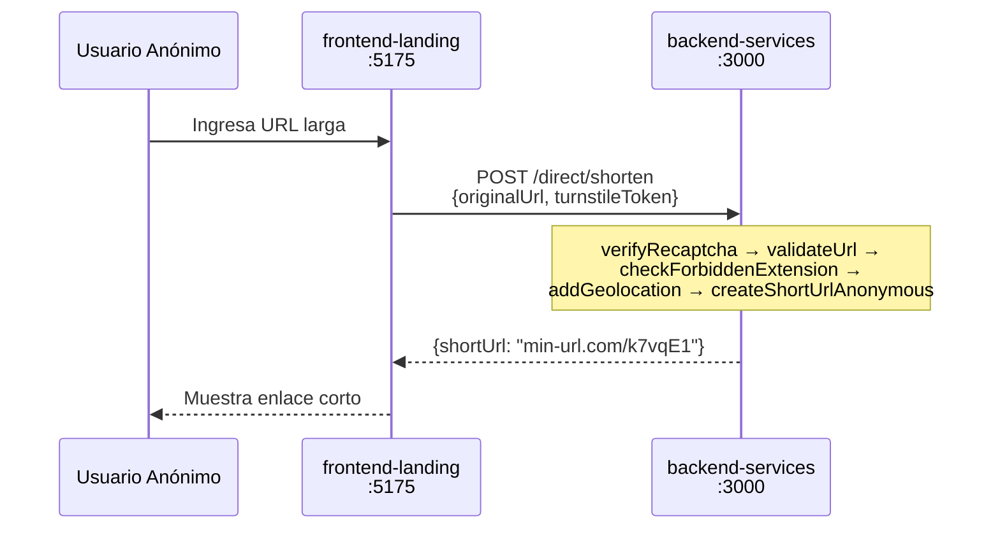
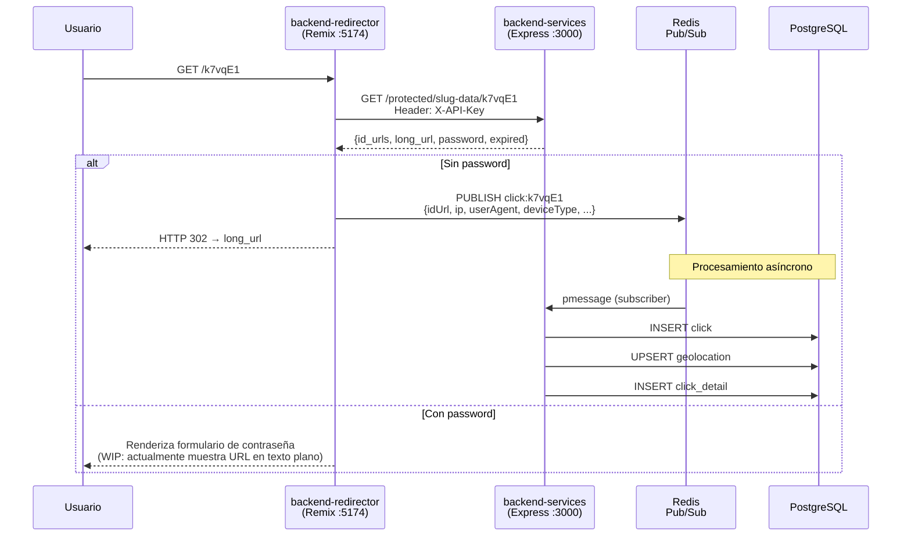
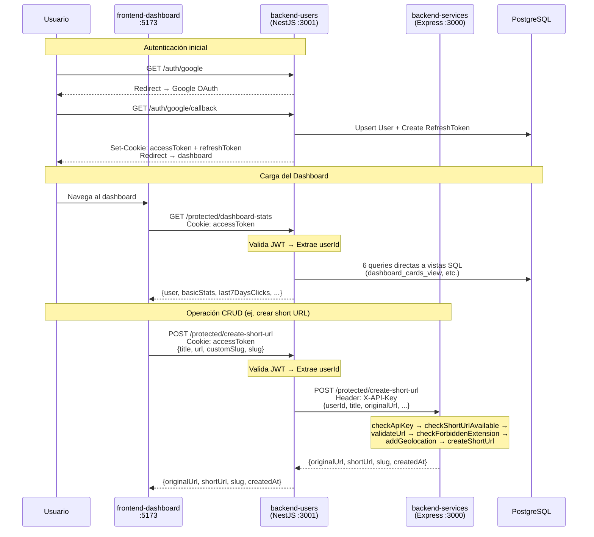

# 🏛️ Arquitectura del Sistema — Min-URL

> Documento de análisis arquitectónico en profundidad.
> Última actualización: 2026-06-25

---

## 1. Resumen Ejecutivo

Min-URL es un **acortador de URLs y generador de QR codes con analíticas en tiempo real**. Está organizado como un **monorepo de 5 paquetes** (3 backends + 2 frontends) orquestados con Turborepo y gestionados con Bun.

La arquitectura **no es un BFF (Backend for Frontend)** ni una arquitectura de microservicios clásica. Es un patrón híbrido que combina características de **API Gateway**, **Proxy Autenticado**, **Event-Driven Architecture** y **Servicio de Edge (Edge Redirect Service)**.

---

## 2. Mapa de Componentes

```
┌─────────────────────────────────────────────────────────────────────────────────┐
│                              USUARIOS FINALES                                    │
│                                                                                  │
│     Usuario Anónimo                        Usuario Registrado                    │
│     (acortar/generar QR)                   (dashboard, CRUD)                    │
└──────┬──────────────┬──────────────────────────────┬────────────────────────────┘
       │              │                              │
       │ (1)          │ (2)                          │ (3)
       │ POST         │ GET /:slug                   │ JWT httpOnly
       │ /direct/     │                              │ Cookie
       │ shorten      │                              │
       ▼              ▼                              ▼
┌──────────────┐  ┌──────────────────┐    ┌───────────────────────┐
│  frontend-   │  │ backend-         │    │  frontend-dashboard   │
│  landing     │  │ redirector       │    │  (React 19 + Vite 6)  │
│  (React 19 + │  │ (Remix 2 SSR)    │    │  TanStack Query v5    │
│   Vite 6)    │  │                  │    │  Zustand 5            │
│  :5175       │  │ :5174            │    │  :5173                │
└──────┬───────┘  └───┬──────┬───────┘    └──────────┬────────────┘
       │              │      │                       │
       │              │(4)   │(5)                    │(6)
       │              │HTTP  │Redis                  │ HTTP
       │              │GET   │Pub                    │ (JWT Cookie)
       │              │      │                       │
       ▼              ▼      │                       ▼
┌──────────────────────────────┐            ┌───────────────────────┐
│       backend-services       │◄───────────│     backend-users     │
│       (Express 4)            │   (7)      │     (NestJS 11)       │
│                              │   HTTP     │                       │
│       :3000                  │   Proxy    │       :3001            │
│                              │  +X-API-   │                       │
│  ┌─────────┐  ┌────────────┐ │   Key     │  ┌──────────────────┐ │
│  │ Public   │  │ Protected  │ │            │  │  Auth (Google    │ │
│  │ Routes   │  │ Routes     │ │            │  │  OAuth2 + JWT)   │ │
│  │ /:slug   │  │ /protected │ │            │  ├──────────────────┤ │
│  │ /direct/ │  │ /*         │ │            │  │  Protected       │ │
│  │  shorten │  │            │ │            │  │  (Dashboard +    │ │
│  └─────────┘  └────────────┘ │            │  │   Proxy CRUD)    │ │
│                              │            │  └──────────────────┘ │
│  ┌──────────────────────────┐│            │                       │
│  │ Redis Subscriber         ││            │  Queries directas a   │
│  │ (pSubscribe click:*)     ││            │  PostgreSQL (vistas   │
│  │ → Click + Detail + Geo   ││            │  SQL del dashboard)   │
│  └──────────────────────────┘│            └───────────────────────┘
└──────────┬───────────────────┘
           │
     ┌─────▼─────┐       ┌─────────────────┐
     │   Redis    │       │   PostgreSQL 16  │
     │  Pub/Sub   │       │                  │
     │   :6379    │       │  Schema "Min-URL" │
     └───────────┘       │  7 tablas         │
                          │  6 vistas SQL     │
                          │  9 índices        │
                          │   :5432           │
                          └─────────────────┘
```

### Leyenda de Flujos

| #       | Origen → Destino                          | Protocolo              | Descripción                           |
| ------- | ----------------------------------------- | ---------------------- | ------------------------------------- |
| **(1)** | `frontend-landing` → `backend-services`   | HTTP POST              | Acortado anónimo (`/direct/shorten`)  |
| **(2)** | Navegador → `backend-redirector`          | HTTP GET               | Redirección de URLs cortas (`/:slug`) |
| **(3)** | `frontend-dashboard` → `backend-users`    | HTTP + JWT Cookie      | Todas las operaciones autenticadas    |
| **(4)** | `backend-redirector` → `backend-services` | HTTP GET + X-API-Key   | Consulta de metadata del slug         |
| **(5)** | `backend-redirector` → Redis              | Redis PUBLISH          | Evento de clic (asíncrono)            |
| **(6)** | `frontend-dashboard` → `backend-users`    | HTTP + JWT Cookie      | CRUD de URLs, QRs, dashboard stats    |
| **(7)** | `backend-users` → `backend-services`      | HTTP Proxy + X-API-Key | Proxy de operaciones CRUD             |

---

## 3. Clasificación Arquitectónica: ¿Qué patrón es realmente?

### ❌ No es un BFF (Backend for Frontend)

Un **BFF** se define por dos características fundamentales:

1. **Existe un backend dedicado por frontend**, optimizado para las necesidades específicas de cada cliente (web, mobile, TV, etc.).
2. **La lógica del BFF se limita a transformar y agregar datos** del downstream para el frontend que atiende.

En Min-URL, `backend-users` no es un BFF porque:

- Atiende a un solo frontend (`frontend-dashboard`), no porque sea un BFF dedicado, sino porque es el único que lo necesita.
- **Contiene lógica propia de dominio**: autenticación OAuth2, gestión de JWT, rotación de tokens, consultas directas a PostgreSQL para KPIs del dashboard.
- **No transforma datos del downstream de forma sustancial**: para las operaciones CRUD, es un proxy casi transparente que solo inyecta el `X-API-Key`.

Un BFF puro no implementaría OAuth2 ni consultaría vistas SQL directamente. Eso lo haría un "User Service" o "Auth Service" en una arquitectura de microservicios.

### ✅ Es un patrón híbrido: API Gateway + Auth Service + Event-Driven Edge

La arquitectura real de Min-URL es una combinación de tres patrones:

#### 3.1 — `backend-users` como **Authenticated API Gateway**

`backend-users` (NestJS) funciona como un **API Gateway autenticado** para el flujo del dashboard:

```
frontend-dashboard ──(JWT Cookie)──► backend-users ──(X-API-Key)──► backend-services
```

**Características de API Gateway que exhibe:**

- **Autenticación centralizada**: Valida JWT en cada request antes de enrutar.
- **Inyección de credenciales internas**: Añade `X-API-Key` + `userId` + `X-Forwarded-For` al proxy.
- **Enrutamiento**: Mapea rutas del dashboard a rutas internas de `backend-services`.
- **Rate limiting**: Aplica throttling global (10 req/min) y por-endpoint (30 req/min para `check-slug`).
- **Agregación de datos**: El endpoint `dashboard-stats` **no proxea** — ejecuta 6 queries SQL directas contra PostgreSQL y agrega la respuesta. Esto es comportamiento de **API Composition/Aggregation**, un patrón típico de API Gateways avanzados.

**¿Por qué no es un API Gateway puro?**

- Tiene su propio modelo de dominio (User, RefreshToken) con persistencia directa en PostgreSQL.
- Implementa lógica de negocio propia: rotación de refresh tokens, generación de access tokens, flujo OAuth2 completo.
- Un API Gateway puro (como Kong, Traefik o AWS API Gateway) no tiene base de datos propia ni modelos de dominio.

**Clasificación precisa**: **Authenticated Reverse Proxy con API Composition** — un middleware inteligente que combina autenticación, proxy y agregación de datos.

#### 3.2 — `backend-services` como **Core Domain Service**

`backend-services` (Express) es el **servicio de dominio central** que posee la lógica de negocio core:

- Gestión de URLs (CRUD, slugs, expiración, passwords)
- Generación de QR codes
- Procesamiento y persistencia de clics (subscriber de Redis)
- Geolocalización offline
- Validación de URLs y slugs
- Generación de slugs con retry logic

**Dos interfaces de acceso:**

| Interfaz      | Ruta                        | Autenticación       | Consumidor                               |
| ------------- | --------------------------- | ------------------- | ---------------------------------------- |
| **Pública**   | `/:slug`, `/direct/shorten` | Ninguna / reCAPTCHA | `frontend-landing`, `backend-redirector` |
| **Protegida** | `/protected/*`              | X-API-Key           | `backend-users`, `backend-redirector`    |

El `X-API-Key` actúa como un **API Key de servicio-a-servicio** (service mesh credential), no como autenticación de usuario final.

#### 3.3 — `backend-redirector` como **Edge Redirect Service**

`backend-redirector` (Remix SSR) es un **servicio de edge** altamente especializado:

- **SSR en el servidor**: Usa Remix loaders para resolver el slug, publicar el evento y redirigir en una sola ejecución server-side.
- **Publicador de eventos**: Escribe en Redis Pub/Sub de forma fire-and-forget (no espera confirmación).
- **Enriquecimiento de datos**: Extrae y enriquece metadata del request (IP, User-Agent, device type, referer, bot detection).
- **No persiste datos**: Solo lee y publica. No tiene base de datos propia.
- **Optimizado para latencia**: La redirección HTTP 302 ocurre inmediatamente después de la publicación en Redis, sin esperar procesamiento.

**¿Por qué se llama "backend"?**
Aunque Remix es técnicamente un framework full-stack (React SSR), `backend-redirector` no renderiza UI para el usuario en el caso normal. En el flujo exitoso:

1. Request `GET /:slug` → Remix loader → consulta `backend-services` → publica en Redis → **HTTP 302 redirect** (sin renderizar componente React).
2. Solo renderiza una página React si: la URL no existe, tiene password, o hay un error.

Es un **servicio SSR que actúa como proxy de redirección inteligente**, más cercano a un edge function o middleware de CDN que a un "backend" tradicional.

---

## 4. Flujos de Comunicación Detallados

### 4.1 — Flujo Anónimo (Landing Page → Short URL)



> [!IMPORTANT]
> **Bug detectado en `.env.development`**: La variable `VITE_SHORT_URL_DIRECT` está definida como `http://localhost:3001/direct/shorten` (URL completa con path), pero el servicio `shortenAnonService.ts` la usa como `${VITE_SHORT_URL_DIRECT}/direct/shorten`, lo que genera la ruta duplicada `http://localhost:3001/direct/shorten/direct/shorten`. Además, apunta al puerto `3001` (backend-users) cuando la ruta `/direct/shorten` solo existe en backend-services (puerto `3000`).

### 4.2 — Flujo de Redirección con Tracking Asíncrono



### 4.3 — Flujo del Dashboard (Usuario Autenticado)



---

## 5. Responsabilidades por Componente

### 5.1 — `backend-services` (Express 4) — El Cerebro

| Responsabilidad                  | Detalle                                              |
| -------------------------------- | ---------------------------------------------------- |
| **CRUD de URLs**                 | Crear, leer, actualizar, soft-delete                 |
| **Generación de Slugs**          | Algoritmo con retry logic y backoff de longitud      |
| **Generación de QR Codes**       | Server-side con colores personalizables              |
| **Procesamiento de Clics**       | Subscriber Redis → Click + ClickDetail + Geolocation |
| **Geolocalización Offline**      | geoip-lite para resolver IP → país/ciudad            |
| **Validación**                   | URLs, extensiones prohibidas, formato de slugs       |
| **Autenticación inter-servicio** | Middleware `checkApiKey` para rutas protegidas       |

**Accede a**: PostgreSQL (todas las tablas excepto `users` y `refresh_tokens`), Redis (subscriber).

### 5.2 — `backend-users` (NestJS 11) — El Guardián

| Responsabilidad             | Detalle                                                                |
| --------------------------- | ---------------------------------------------------------------------- |
| **Autenticación OAuth2**    | Google OAuth con Passport.js                                           |
| **Gestión JWT**             | Access token (24h) + Refresh token (7 días) en httpOnly cookies        |
| **Rotación de tokens**      | Endpoint `/auth/refresh` para renovar access tokens                    |
| **Proxy CRUD**              | Reenvía operaciones del dashboard a `backend-services` con `X-API-Key` |
| **Agregación de Dashboard** | 6 queries directas a vistas SQL → payload unificado                    |
| **Rate Limiting**           | Throttler global + por-endpoint                                        |

**Accede a**: PostgreSQL (tablas `users` y `refresh_tokens` + 6 vistas SQL), `backend-services` (HTTP).

### 5.3 — `backend-redirector` (Remix 2 SSR) — El Velocista

| Responsabilidad                 | Detalle                                             |
| ------------------------------- | --------------------------------------------------- |
| **Resolución de Slugs**         | Consulta metadata vía `backend-services`            |
| **Redirección HTTP 302**        | Redirect no-bloqueante                              |
| **Publicación de Clics**        | Fire-and-forget a Redis Pub/Sub                     |
| **Enriquecimiento de Metadata** | IP, User-Agent, device type, referer                |
| **Detección de Bots**           | Filtro con `isbot` (importado, uso pendiente)       |
| **Flujo de Password**           | WIP: renderizado de formulario para URLs protegidas |

**Accede a**: `backend-services` (HTTP con X-API-Key), Redis (publisher). **No accede directamente a PostgreSQL.**

### 5.4 — `frontend-landing` (React 19 + Vite 6) — La Vitrina

| Responsabilidad               | Detalle                                                |
| ----------------------------- | ------------------------------------------------------ |
| **Acortado anónimo**          | Formulario `POST /direct/shorten` a `backend-services` |
| **Generación de QR estática** | Pestaña QR tool (client-side preview)                  |
| **Captcha**                   | Protección anti-bot (migración a Turnstile pendiente)  |

**Se comunica con**: `backend-services` (HTTP directo, sin autenticación JWT).

### 5.5 — `frontend-dashboard` (React 19 + Vite 6) — El Comando

| Responsabilidad         | Detalle                                      |
| ----------------------- | -------------------------------------------- |
| **Dashboard analítico** | KPIs, gráficos, top links/QRs                |
| **CRUD de URLs y QRs**  | Crear, editar, eliminar enlaces y códigos QR |
| **Autenticación**       | Login con Google, gestión de sesión          |
| **i18n**                | Español/Inglés                               |
| **Tema**                | Dark/Light mode                              |

**Se comunica exclusivamente con**: `backend-users` (HTTP con JWT Cookie).

---

## 6. Modelo de Seguridad

### Capas de Autenticación

```
┌─────────────────────────────────────────────────────┐
│             CAPA 1: Usuario → Frontend              │
│                                                     │
│  frontend-dashboard ◄── JWT httpOnly Cookie         │
│  frontend-landing   ◄── Turnstile token (anti-bot)  │
│  Navegador          ◄── Ninguna (GET /:slug)        │
└──────────────────────┬──────────────────────────────┘
                       │
┌──────────────────────▼──────────────────────────────┐
│          CAPA 2: Frontend → Backend Gateway         │
│                                                     │
│  frontend-dashboard → backend-users:                │
│    • JWT Access Token en httpOnly Cookie             │
│    • Validado por Passport JWT Strategy              │
│    • Throttled (10 req/min global)                   │
│                                                     │
│  frontend-landing → backend-services:               │
│    • Turnstile token en body                        │
│    • Validado por middleware verifyRecaptcha         │
│    • Sin autenticación de usuario                   │
└──────────────────────┬──────────────────────────────┘
                       │
┌──────────────────────▼──────────────────────────────┐
│         CAPA 3: Servicio → Servicio (Internal)      │
│                                                     │
│  backend-users → backend-services:                  │
│    • X-API-Key (shared secret)                      │
│    • X-Forwarded-For (IP del cliente original)      │
│                                                     │
│  backend-redirector → backend-services:             │
│    • X-API-Key (mismo shared secret)                │
│                                                     │
│  backend-redirector → Redis:                        │
│    • Conexión directa (sin auth, red interna)       │
└─────────────────────────────────────────────────────┘
```

### Decisiones de Seguridad Clave

| Decisión                      | Implementación                                                  | Estado                                                  |
| ----------------------------- | --------------------------------------------------------------- | ------------------------------------------------------- |
| JWT en httpOnly cookies       | Previene XSS, token no accesible desde JS del cliente           | ✅ Implementado                                         |
| `sameSite: strict`            | Previene CSRF en cookies                                        | ✅ Implementado                                         |
| `secure: true` en producción  | Cookies solo sobre HTTPS                                        | ✅ Implementado                                         |
| X-API-Key inter-servicio      | Shared secret entre backends                                    | ✅ Implementado                                         |
| Anti-bot (CAPTCHA)            | Protege endpoint anónimo de abuso                               | ✅ Funcional (pendiente migración a Turnstile)          |
| Rate limiting                 | NestJS Throttler + Express rate-limit                           | ⚠️ Express rate-limit existe pero no está montado       |
| Access token en JSON response | `protected.service.ts` línea 120 devuelve `accessToken` en body | 🔴 **Vulnerabilidad**: expone el JWT fuera de la cookie |

---

## 7. Modelo de Datos

### Esquema PostgreSQL — `"Min-URL"`

```
┌──────────────┐     ┌──────────────────┐
│    users     │────►│ refresh_tokens   │
│              │     │ (1:N, cascade)   │
│  id_users    │     └──────────────────┘
│  google_id   │
│  github_id   │──┐
│  email       │  │  ┌──────────────────┐     ┌──────────────┐
│  displayName │  └─►│      urls        │────►│  short_urls  │
│  shortUrl... │     │                  │     │ (1:1)        │
│  qrCode...   │     │  id_urls         │     │ slug         │
└──────────────┘     │  user_id (null?) │     └──────────────┘
                     │  long_url        │
                     │  title           │     ┌──────────────┐
                     │  password        │────►│   qr_codes   │
                     │  expired         │     │ (1:1)        │
                     │  deleted         │     │ fg/bg color  │
                     │  clicks (count)  │     └──────────────┘
                     └──────┬───────────┘
                            │
                            │ (1:N)
                            ▼
                     ┌──────────────────┐
                     │     clicks       │
                     │  id_clicks       │
                     │  url_id          │
                     └──────┬───────────┘
                            │ (1:1)
                            ▼
                     ┌──────────────────┐
                     │  clicks_details  │
                     │  click_id        │
                     │  geolocations_id │──────►┌──────────────────┐
                     │  user_agent      │       │  geolocations    │
                     │  device_type     │       │  ip_address      │
                     │  referer         │       │  country/city    │
                     └──────────────────┘       │  lat/lng         │
                                                └──────────────────┘
```

### Ownership de Tablas por Servicio

| Tabla            | Leída por                                        | Escrita por                           |
| ---------------- | ------------------------------------------------ | ------------------------------------- |
| `users`          | `backend-users`                                  | `backend-users`                       |
| `refresh_tokens` | `backend-users`                                  | `backend-users`                       |
| `urls`           | `backend-services`, `backend-users` (vía vistas) | `backend-services`                    |
| `short_urls`     | `backend-services`, `backend-users` (vía vistas) | `backend-services`                    |
| `qr_codes`       | `backend-services`, `backend-users` (vía vistas) | `backend-services`                    |
| `clicks`         | `backend-users` (vía vistas)                     | `backend-services` (subscriber Redis) |
| `clicks_details` | `backend-users` (vía vistas)                     | `backend-services` (subscriber Redis) |
| `geolocations`   | `backend-services`                               | `backend-services`                    |
| **6 vistas SQL** | `backend-users` (queries directas)               | —                                     |

> [!WARNING]
> **Shared Database Anti-Pattern**: `backend-users` y `backend-services` comparten la misma base de datos PostgreSQL. Esto crea un acoplamiento fuerte a nivel de datos. En una arquitectura de microservicios pura, cada servicio tendría su propia base de datos. Sin embargo, para el alcance actual del proyecto, es una decisión pragmática que simplifica el desarrollo y elimina la necesidad de sincronización eventual.

---

## 8. Comunicación Inter-Servicio

### 8.1 — Protocolo y Autenticación

| Origen                                    | Destino            | Protocolo | Auth                        | Tipo |
| ----------------------------------------- | ------------------ | --------- | --------------------------- | ---- |
| `backend-users` → `backend-services`      | HTTP (axios)       | X-API-Key | Síncrono (request-response) |
| `backend-redirector` → `backend-services` | HTTP (axios)       | X-API-Key | Síncrono (request-response) |
| `backend-redirector` → Redis              | ioredis PUBLISH    | Ninguna   | Asíncrono (fire-and-forget) |
| Redis → `backend-services`                | ioredis pSUBSCRIBE | Ninguna   | Asíncrono (event-driven)    |

### 8.2 — Mapa de Endpoints de backend-services

#### Rutas Públicas (sin autenticación)

| Método | Ruta              | Consumidor                                          | Propósito           |
| ------ | ----------------- | --------------------------------------------------- | ------------------- |
| `GET`  | `/:slug`          | `backend-redirector` (legacy, no usado actualmente) | Redirección directa |
| `POST` | `/direct/shorten` | `frontend-landing`                                  | Acortado anónimo    |

#### Rutas Protegidas (X-API-Key requerida)

| Método   | Ruta                                           | Consumidor           | Propósito                              |
| -------- | ---------------------------------------------- | -------------------- | -------------------------------------- |
| `GET`    | `/protected/slug-data/:slug`                   | `backend-redirector` | Obtener metadata del slug              |
| `POST`   | `/protected/check-slug`                        | `backend-users`      | Verificar disponibilidad de slug       |
| `POST`   | `/protected/create-short-url`                  | `backend-users`      | Crear short URL con slug aleatorio     |
| `POST`   | `/protected/create-short-url-with-custom-slug` | `backend-users`      | Crear short URL con slug personalizado |
| `POST`   | `/protected/create-qr-code`                    | `backend-users`      | Crear QR code                          |
| `DELETE` | `/protected/delete-url/:id`                    | `backend-users`      | Soft-delete de URL                     |
| `PATCH`  | `/protected/update-url/:id`                    | `backend-users`      | Actualizar URL                         |

### 8.3 — Mapa de Endpoints de backend-users

| Método   | Ruta                          | Consumidor           | Propósito                 | ¿Proxea a backend-services?   |
| -------- | ----------------------------- | -------------------- | ------------------------- | ----------------------------- |
| `GET`    | `/auth/google`                | Navegador            | Iniciar OAuth2 Google     | No                            |
| `GET`    | `/auth/google/callback`       | Google OAuth         | Callback de autenticación | No                            |
| `POST`   | `/auth/refresh`               | `frontend-dashboard` | Renovar access token      | No                            |
| `GET`    | `/auth/logout`                | `frontend-dashboard` | Cerrar sesión             | No                            |
| `GET`    | `/protected/dashboard-stats`  | `frontend-dashboard` | KPIs y estadísticas       | **No** (queries SQL directas) |
| `POST`   | `/protected/check-slug`       | `frontend-dashboard` | Verificar slug            | **Sí**                        |
| `POST`   | `/protected/create-short-url` | `frontend-dashboard` | Crear short URL           | **Sí**                        |
| `POST`   | `/protected/create-qr-code`   | `frontend-dashboard` | Crear QR code             | **Sí**                        |
| `DELETE` | `/protected/delete-url/:id`   | `frontend-dashboard` | Eliminar URL              | **Sí**                        |
| `PATCH`  | `/protected/update-url/:id`   | `frontend-dashboard` | Actualizar URL            | **Sí**                        |

> [!NOTE]
> De los 10 endpoints de `backend-users`, **5 son proxy transparente** hacia `backend-services`, **4 son de autenticación** (lógica propia), y **1 es de agregación** (dashboard-stats con queries SQL directas). Esto confirma el rol dual de Gateway + Auth Service.

---

## 9. Inconsistencias y Problemas Detectados

### 🔴 Críticos

| #   | Problema                                 | Ubicación                                    | Impacto                                                                                                                                                                     |
| --- | ---------------------------------------- | -------------------------------------------- | --------------------------------------------------------------------------------------------------------------------------------------------------------------------------- |
| 1   | **`accessToken` expuesto en JSON**       | `protected.service.ts:120`                   | El JWT se devuelve en el body de la respuesta, haciéndolo accesible desde JavaScript del cliente. Derrota el propósito de httpOnly cookies.                                 |
| 2   | **Doble path en env del landing**        | `.env.development` + `shortenAnonService.ts` | `VITE_SHORT_URL_DIRECT` contiene `/direct/shorten` pero el servicio concatena `/direct/shorten` de nuevo. Resultado: `http://localhost:3001/direct/shorten/direct/shorten`. |
| 3   | **Puerto incorrecto en env del landing** | `.env.development`                           | Las URLs apuntan a `:3001` (backend-users) pero las rutas `/direct/shorten` y `/qr/qrcode` solo existen en backend-services (`:3000`).                                      |

### 🟡 Media

| #   | Problema                                | Ubicación                     | Impacto                                                                           |
| --- | --------------------------------------- | ----------------------------- | --------------------------------------------------------------------------------- |
| 4   | `console.log` en producción             | Múltiples archivos            | Sin logging estructurado; dificulta debugging en producción.                      |
| 5   | Rate limiter de Express no montado      | `middleware/limitRequests.js` | El middleware existe pero no está en ninguna ruta.                                |
| 6   | WebSocket stub vacío                    | `dashboard.gateway.ts`        | Socket.io-client instalado en frontend pero el gateway es un placeholder.         |
| 7   | CORS de backend-users es `origin: true` | `main.ts:9`                   | Acepta CUALQUIER origen. Backend-services tiene whitelist, pero backend-users no. |
| 8   | Comentario de duración incorrecto       | `auth.controller.ts:52`       | Dice "Duración de 30 minutos" pero el maxAge es 24 horas.                         |

### 🟠 Baja

| #   | Problema                    | Ubicación                                      | Impacto                                                                                                                            |
| --- | --------------------------- | ---------------------------------------------- | ---------------------------------------------------------------------------------------------------------------------------------- |
| 9   | Import case-sensitive       | `ShorturlServices.js` vs `ShortUrlServices.js` | Funciona en Windows pero fallará en Linux (CI/CD y producción).                                                                    |
| 10  | Ruta `GET /:slug` duplicada | `backend-services/routes/shorturl.js`          | `getShortUrl` existe como ruta pública con redirect directo, pero el flujo real va por `backend-redirector`. Redundancia no usada. |

---

## 10. Diagrama de Despliegue (Propuesto — Producción)

```
                    ┌──────────────────────┐
                    │   Cloudflare DNS +   │
                    │   CDN / Turnstile    │
                    └──────────┬───────────┘
                               │
              ┌────────────────┼────────────────┐
              │                │                │
     min-url.com/       min-url.com        app.min-url.com
     :slug              (landing)          (dashboard)
              │                │                │
              ▼                ▼                ▼
     ┌────────────────┐ ┌────────────┐ ┌────────────────┐
     │ backend-       │ │ frontend-  │ │ frontend-      │
     │ redirector     │ │ landing    │ │ dashboard      │
     │ (Railway /     │ │ (Vercel)   │ │ (Vercel)       │
     │  Render)       │ │            │ │                │
     └───────┬────────┘ └─────┬──────┘ └───────┬────────┘
             │                │                │
             │                │                │
             ▼                ▼                ▼
     ┌──────────────────────────────────────────────┐
     │            Red Interna de Servicios           │
     │                                              │
     │  ┌──────────────┐    ┌──────────────────┐   │
     │  │  backend-    │    │   backend-users   │   │
     │  │  services    │    │   (Railway)       │   │
     │  │  (Railway)   │    └──────────────────┘   │
     │  └──────────────┘                           │
     └──────────────┬───────────────┬──────────────┘
                    │               │
           ┌────────▼───────┐ ┌────▼──────────┐
           │  PostgreSQL    │ │    Redis       │
           │  (Neon)        │ │  (Upstash)     │
           └────────────────┘ └───────────────┘
```

---

## 11. Comparación con Patrones Arquitectónicos Conocidos

| Patrón              | ¿Lo implementa Min-URL? | Dónde                                                                                                |
| ------------------- | ----------------------- | ---------------------------------------------------------------------------------------------------- |
| **API Gateway**     | ✅ Parcialmente         | `backend-users` actúa como gateway autenticado para `frontend-dashboard`                             |
| **BFF**             | ❌                      | No hay backend-per-frontend; el landing habla directo con `backend-services`                         |
| **Reverse Proxy**   | ✅                      | `backend-users` proxea CRUD a `backend-services`                                                     |
| **API Composition** | ✅                      | `dashboard-stats` agrega 6 queries SQL en un solo payload                                            |
| **Event-Driven**    | ✅                      | Redis Pub/Sub para tracking asíncrono de clics                                                       |
| **CQRS (parcial)**  | ✅ Emergente            | Las escrituras van por `backend-services`, las lecturas analíticas por vistas SQL en `backend-users` |
| **Edge Service**    | ✅                      | `backend-redirector` como servicio de borde optimizado para latencia                                 |
| **Shared Database** | ✅ (anti-pattern)       | Ambos backends comparten PostgreSQL                                                                  |
| **Strangler Fig**   | Potencial               | La migración a hexagonal puede usar este patrón módulo por módulo                                    |

---

## 12. Visión Futura (del Roadmap Personal)

Basado en el análisis de [`development_roadmap.md`](file:///d:/Proyectos/Min-URL/personal_notes/development_roadmap.md) y [`implementation_plan.md`](file:///d:/Proyectos/Min-URL/personal_notes/implementation_plan.md):

### Fase 1 (Actual) — UI/UX + Bugs Críticos

- Completar landing page
- Corregir bugs de seguridad y env
- Implementar flujo de password en redirector
- Migrar reCAPTCHA → Cloudflare Turnstile

### Fase 2 — Dockerización + MongoDB

- Dockerfiles por servicio
- docker-compose maestro
- Migrar clics de PostgreSQL a MongoDB (Event Store)

### Fase 3 — Arquitectura Hexagonal

- Puertos y Adaptadores en NestJS y Express
- Migración módulo por módulo

### Fase 4 — AWS Emulado (LocalStack)

- S3 para QR codes
- CloudWatch para logging estructurado

### Fase 5 — Testing + CI/CD

- Vitest (unit/integration)
- Playwright (E2E)
- GitHub Actions pipeline

### Fase 6 — Observabilidad + Despliegue

- Prometheus + Grafana
- K6 para load testing
- Deploy a Railway/Vercel/Neon

### Modelo de Créditos Universales (Futuro)

- Reemplazar cuotas separadas de URLs/QRs por créditos unificados (100 créditos base)
- 1 crédito = Short URL, 2 = QR, 3 = Link protegido
