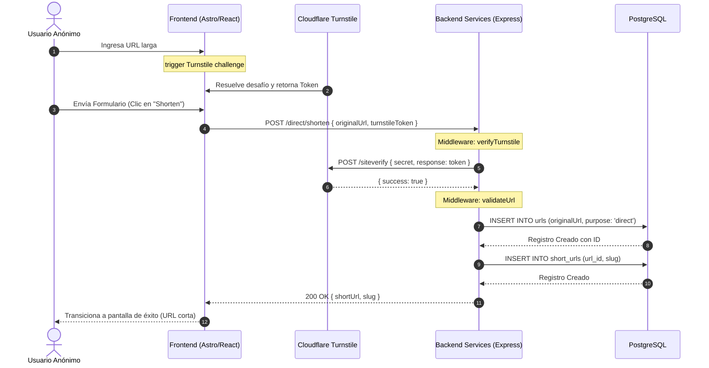
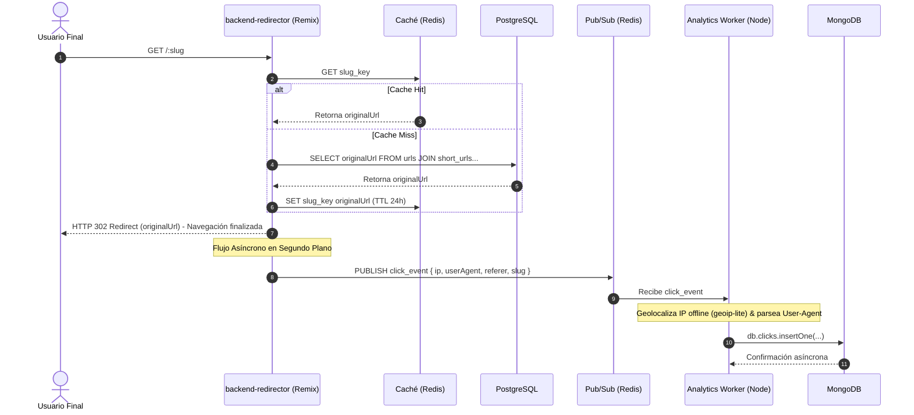
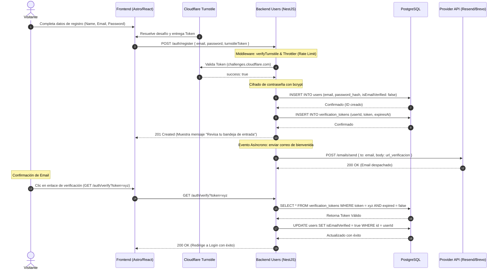
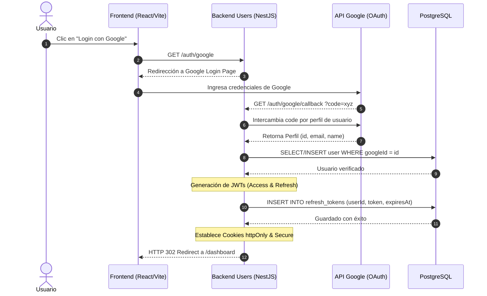

# Casos de Uso Core y Diagramas de Secuencia (MVP v1) — Min-URL

Este documento detalla la especificación de ingeniería para los casos de uso principales de la plataforma **Min-URL** en su versión MVP (v1). Define los flujos de control, diagramas de secuencia Mermaid, Objetivos de Nivel de Servicio (SLOs) y las medidas de seguridad críticas contra abuso y spam de infraestructura.

---

## 👥 Actores del Sistema

- **Usuario Anónimo**: Visitante de la landing page pública que desea acortar URLs sin registrarse.
- **Usuario Registrado**: Usuario autenticado en la plataforma que posee un panel de control (Dashboard) para gestionar sus enlaces y ver métricas avanzadas.
- **Usuario Final**: Cualquier internauta o bot que hace clic en una URL acortada generada por la plataforma.

---

## 📐 1. Caso de Uso: Acortar URL de forma Anónima

### Descripción

Permite a cualquier visitante de la landing acortar una URL larga de forma ágil, protegiendo al backend de saturación por spam mediante validaciones perimetrales con Cloudflare Turnstile.

### Flujo Técnico:

1. El usuario ingresa una URL larga en el componente `ShortenerForm`.
2. El sistema valida el formato de la URL en el cliente mediante la función de utilidad `validateUrl` (con debounce de 500ms).
3. Al cargar el formulario, el hook `useTurnstile` inicializa el widget de Cloudflare en segundo plano, obteniendo de forma asíncrona un token de verificación de un solo uso.
4. El usuario envía el formulario. El botón se bloquea durante el estado de carga (`isLoading`).
5. El backend (`backend-services` - Express) recibe la petición en `POST /direct/shorten`.
6. **Filtro Perimetral (Middleware: `verifyTurnstile`)**: Se valida el token contra la API de Cloudflare (`/siteverify`). Si falta el token, responde con `400 Bad Request`. Si el token es inválido o reutilizado, responde con `403 Forbidden`.
7. **Validación de Datos (Middleware: `validateUrl`)**: Comprueba que la URL original sea un string válido y seguro.
8. El backend genera un identificador único (slug) de 6 caracteres alfanuméricos, inserta la URL en PostgreSQL, y retorna la respuesta.
9. El frontend transiciona a la pantalla de éxito mostrando el enlace corto listo para copiar.

### 📊 Objetivos de Nivel de Servicio (SLO):

- **SLI**: Latencia de la petición `POST /direct/shorten`.
- **SLO (Normal)**: p95 < 400ms.
- **SLO (Bajo Ataque)**: p99 < 2500ms.

### 🔗 Diagrama de Secuencia:

---

## 📐 2. Caso de Uso: Redirección de URL Corta y Tracking Analítico Asíncrono

### Descripción

El flujo más crítico en términos de rendimiento. Al recibir una petición a un enlace corto, el sistema redirige al usuario final a velocidad extrema mientras procesa el registro analítico (geolocalización, metadatos) en segundo plano sin bloquear la navegación.

### Flujo Técnico:

1. El usuario final hace clic en una URL corta (p. ej., `min.url/abc123`).
2. La petición llega a `backend-redirector` (Remix SSR).
3. **Optimización de Borde**: El redireccionador comprueba si el destino del slug se encuentra en la caché de **Redis**.
   - **Caso Éxito (Cache Hit)**: Retorna de inmediato la URL de destino de Redis.
   - **Caso Fallo (Cache Miss)**: Consulta el slug en PostgreSQL, lo almacena en Redis (TTL 24h) y lo retorna.
4. El redireccionador responde al navegador del cliente con una redirección HTTP `302 Found`.
5. **Procesamiento de Métricas Asíncrono**: Tras responder al usuario, el redireccionador publica un evento JSON estructurado en **Redis Pub/Sub** (`click_events`).
6. Un microservicio consumidor independiente (Worker de Node) recibe el evento, geolocaliza la IP de forma offline mediante `geoip-lite` y normaliza los navegadores/dispositivos mediante `ua-parser-js`.
7. El Worker inserta el documento estructurado del clic en la base de datos analítica NoSQL (**MongoDB**).

### 📊 Objetivos de Nivel de Servicio (SLO):

- **SLI**: Latencia desde la petición HTTP inicial hasta el envío del status `302 Found`.
- **SLO (Cache Hit)**: p95 < 30ms.
- **SLO (Cache Miss)**: p95 < 150ms.

### 🔗 Diagrama de Secuencia:

---

## 📐 3. Caso de Uso: Registro de Usuario y Verificación de Email (Protección contra Email Bombing)

### Descripción

Permite a visitantes crear una cuenta local proporcionando su nombre, email y contraseña. Se implementa un esquema de defensa perimetral con Turnstile y límites estrictos de tasa (Throttling) para evitar el abuso del servidor de correos gratuito.

### Flujo Técnico:

1. El visitante ingresa a la página de registro y completa sus credenciales.
2. El formulario requiere la resolución exitosa del widget de Turnstile de Cloudflare en segundo plano.
3. El frontend envía un `POST /auth/register` al microservicio `backend-users` (NestJS).
4. **Seguridad contra Spam de Cuentas (Throttling & Captcha)**:
   - El middleware comprueba el token de Turnstile. Si falla, corta el flujo.
   - El NestJS Throttler evalúa la IP de origen (Límite: **3 intentos de registro por IP cada 15 minutos**). Si excede, responde con `429 Too Many Requests`.
5. El backend cifra la contraseña usando un algoritmo de hash con sal (bcrypt) y guarda al usuario en PostgreSQL con la columna `isEmailVerified` establecida en `false`.
6. El backend genera un token único de verificación criptográfico (UUID con TTL de 24 horas) y responde inmediatamente al cliente con un `201 Created` informándole que revise su correo.
7. El backend emite un evento asíncrono en segundo plano (`user.registered`).
8. El manejador de eventos del módulo de emails llama al SDK del proveedor de correo (**Resend o Brevo**) para enviar el email con la URL de verificación (`https://min-url.com/auth/verify?token=XYZ`).
9. El usuario hace clic en el enlace del email, llamando al endpoint `GET /auth/verify`. El sistema verifica el token, marca `isEmailVerified: true` y redirige al login.

### 📊 Objetivos de Nivel de Servicio (SLO):

- **SLI**: Tiempo de respuesta HTTP del endpoint `POST /auth/register` (sin contar el envío de correo).
- **SLO (Normal)**: p95 < 350ms.

### 🔗 Diagrama de Secuencia:

---

## 📐 4. Caso de Uso: Autenticación (Inicio de Sesión Local y Google OAuth)

### Descripción

Permite a los usuarios autenticarse para acceder a su panel de control administrativo (Dashboard) de manera segura, utilizando tokens JWT de corta duración y mecanismos para refrescar sesiones mediante cookies inaccesibles por JavaScript (`httpOnly`).

### Flujo Técnico (Google OAuth):

1. El usuario hace clic en "Iniciar Sesión con Google" en el cliente.
2. El cliente redirige a `GET /auth/google` en `backend-users`.
3. El middleware de Passport redirige al servidor de login de Google.
4. Tras validarse, Google redirige a `GET /auth/google/callback` en nuestro backend proporcionando el perfil del usuario.
5. El backend busca o crea al usuario en PostgreSQL, firma dos tokens JWT:
   - **Access Token**: Guardado en la cookie `access_token` (`httpOnly`, `Secure`, `SameSite: strict`, TTL corta de 24h).
   - **Refresh Token**: Almacenado en la base de datos y guardado en la cookie `refresh_token` (`httpOnly`, `Secure`, TTL de 7 días).
6. El servidor responde redireccionando directamente al Dashboard del usuario.

### 📊 Objetivos de Nivel de Servicio (SLO):

- **SLI**: Latencia de la redirección local tras recibir el callback de Google.
- **SLO (Normal)**: p95 < 250ms.

### 🔗 Diagrama de Secuencia:

---

## 📐 5. Caso de Uso: Crear URL Corta como Usuario Autenticado

### Descripción

Permite a un usuario logueado en su Dashboard crear un enlace acortado persistente que estará asociado permanentemente a su historial de links, omitiendo los retos de Turnstile por poseer una sesión válida.

### Flujo Técnico:

1. El usuario autenticado ingresa la URL original en el Dashboard.
2. El frontend envía un `POST /shorten` al backend, inyectando de forma transparente las credenciales de sesión a través de la cookie del navegador.
3. El backend intercepta la cookie, valida el JWT y asocia la creación de la URL al `user_id` decodificado de la firma del token.
4. El backend genera el slug e inserta la URL en PostgreSQL.
5. El sistema retorna la información estructurada del nuevo enlace corto de forma inmediata al cliente.

### 📊 Objetivos de Nivel de Servicio (SLO):

- **SLI**: Latencia de la petición `POST /shorten`.
- **SLO (Normal)**: p95 < 300ms.

---

## 📐 6. Caso de Uso: Visualización de Métricas Consolidadas (Dashboard)

### Descripción

Permite a los usuarios registrados analizar de forma interactiva y veloz el rendimiento de sus enlaces cortos en el Dashboard mediante gráficos analíticos detallados que consultan la base de datos NoSQL de MongoDB.

### Flujo Técnico:

1. El usuario inicia sesión y accede al panel de estadísticas de un enlace.
2. El frontend realiza una petición HTTP `GET /analytics/:linkId`.
3. El backend intercepta la sesión (JWT), valida que la propiedad del enlace corresponda al usuario actual y realiza la agregación analítica en **MongoDB**.
4. **Agregaciones Optimizadas**: MongoDB realiza operaciones de acumulación agrupando clics por dispositivo (móvil, escritorio), sistemas operativos, navegadores más comunes, geolocalización (país y provincia) e intervalos de tiempo.
5. El backend retorna los datos agregados en formato JSON estructurado.
6. El frontend procesa el payload y renderiza de inmediato las estadísticas interactivas.

### 📊 Objetivos de Nivel de Servicio (SLO):

- **SLI**: Latencia de procesamiento de agregaciones del endpoint `GET /analytics/:linkId`.
- **SLO (Normal)**: p95 < 800ms.
- **SLO (Bajo alta carga de datos)**: p99 < 3000ms.
