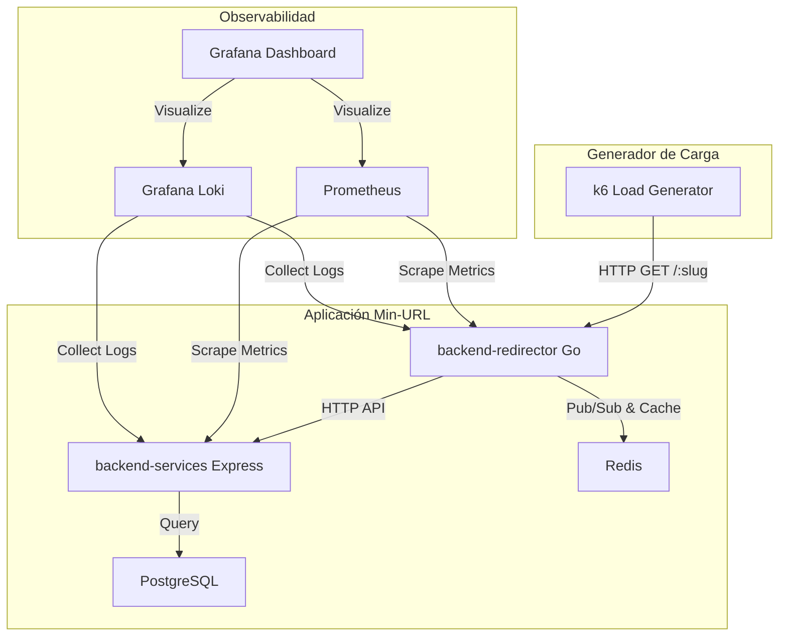

# ADR-006: Estrategia de Caché, Pub/Sub Analítico y Pruebas de Carga con Observabilidad

- **Estado**: Propuesto
- **Fecha**: 2026-07-02
- **Autor**: Paolo Herrera

---

## Contexto y Problemática

Para validar cuantitativamente los Objetivos de Nivel de Servicio (SLOs) definidos en el MVP (p95 < 30ms en Cache Hit, p95 < 150ms en Cache Miss), necesitamos una infraestructura de pruebas y observabilidad estructurada. No podemos basarnos en suposiciones; requerimos recolectar telemetría en tiempo real bajo escenarios de estrés simulados.

Adicionalmente, debemos definir exactamente cómo interactúan PostgreSQL y Redis para mantener la consistencia de los datos analíticos y el redireccionamiento sin bloquear el hilo principal de ejecución.

---

## Decisión de Arquitectura

Se definen tres pilares técnicos fundamentales para resolver la consistencia, el procesamiento asíncrono y la medición de rendimiento:

### 1. Estrategia de Caching y Consistencia

- **Estructura en Redis**:
  - Clave: `slug:${slug}`
  - Valor: Objeto JSON conteniendo: `{ "id_urls": "...", "long_url": "...", "password": true/false }`.
  - TTL (Time-To-Live): 24 horas (86400 segundos).
- **Invalidación de Caché**:
  - Cuando un usuario edita o elimina un enlace a través del dashboard, `backend-services` emitirá un comando `DEL slug:${slug}` a Redis de forma sincrónica antes de confirmar la transacción HTTP al cliente. Esto garantiza consistencia de lectura inmediata.

### 2. Procesamiento de Analíticas Asíncronas (Pub/Sub)

- **Canal**: `click:${slug}`
- **Publicador**: `backend-redirector` (Go) o `backend-services` (Express, tras validar contraseña).
- **Consumidor (Worker)**: Un proceso de fondo persistente configurado en `backend-services` (Node.js) que se suscribe con `psubscribe('click:*')`.
- **Procesamiento Offline**:
  - El Worker recibe el evento de forma asíncrona.
  - Busca la IP en la base de datos local de geolocalización utilizando `geoip-lite` (base de datos MaxMind offline sin llamadas de red).
  - Parsea el agente de usuario (Browser, OS, Dispositivo) utilizando `ua-parser-js`.
  - Inserta los registros correspondientes en las tablas transaccionales de PostgreSQL de forma no bloqueante para el usuario final.

### 3. Suite de Pruebas de Carga y Observabilidad

Para medir de forma rigurosa el comportamiento y la escalabilidad del sistema, se estructurará la siguiente infraestructura en contenedores Docker:

- **Generador de Carga (k6)**:
  - Se utilizará `k6` por su altísimo rendimiento, bajo consumo de CPU y soporte para scripts de escenarios en JavaScript.
  - Escenarios a probar:
    1. **Estrés Directo (Cache Hit)**: Hitar continuamente URLs cacheadas para medir la latencia pura del redireccionador en Go (objetivo: 10,000+ RPS, p95 < 20ms).
    2. **Fuga de Caché (Cache Miss)**: Hitar slugs aleatorios no existentes o no cacheados para evaluar el impacto en la base de datos Postgres y el backend Express.
- **Mapeo de Telemetría (Prometheus & Grafana)**:
  - El redireccionador expone un endpoint `/metrics` en formato OpenMetrics.
  - Prometheus recopila estas métricas periódicamente.
  - Grafana proporciona dashboards en tiempo real para visualizar:
    - Latencia media y percentiles (p50, p95, p99).
    - Tasa de Acierto de Caché (Cache Hit vs. Cache Miss Ratio).
    - Consumo de recursos de hardware (Memoria, CPU, Goroutines activas).
- **Centralización de Logs (Loki)**:
  - Grafana Loki actuará como agregador de logs estructurados desde los contenedores Docker, facilitando el análisis causa-raíz cuando se introduzcan fallos artificiales de concurrencia.

---

## Consecuencias y Beneficios

- **Evidencia Basada en Datos**: Podremos comprobar de forma científica si la base de datos PostgreSQL se satura con las escrituras analíticas y validar la necesidad de mover el volumen a MongoDB.
- **Monitoreo Profesional**: La integración de Prometheus/Grafana provee capacidades de observabilidad idénticas a un entorno de producción real, excelente como portafolio técnico frente a reclutadores.
- **Seguridad y Aislamiento**: Al realizar la geolocalización offline (sin APIs externas) y analíticas asíncronas, el usuario final nunca experimenta retrasos en su navegación debidos a procesos de fondo.
